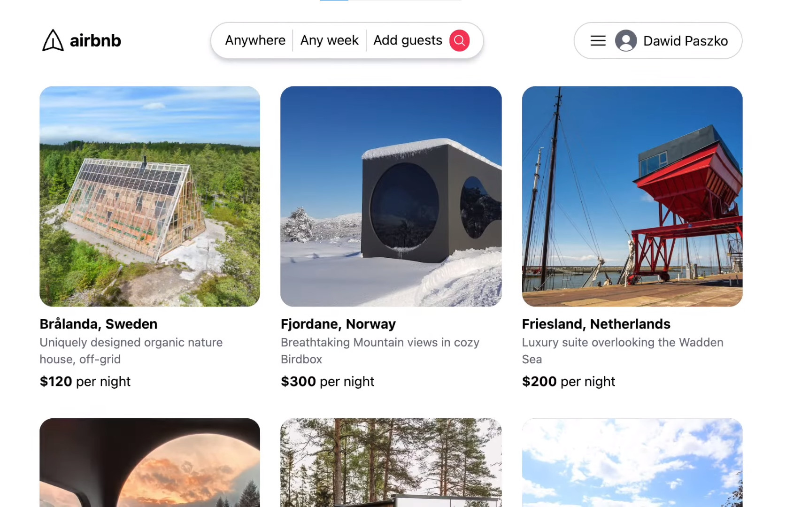

# BookingApp

The BookingApp project is a web application designed to streamline the booking process for various services. It offers users the convenience of booking appointments, reservations, and services online, eliminating the need for traditional manual scheduling.

[Login and Register]
[Search Search and View Service]
[Online booking]
[Reservation management]
[Payment and confirmation]
[Free account management]
[Reviews and Comments]
[Customer support]
[Statistical system administration]

